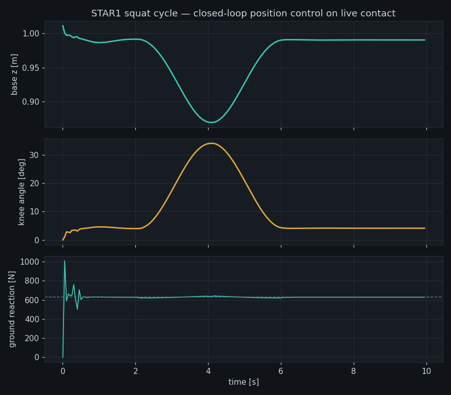

# Humanoid Twin Platform

**URDF in, running digital twin out.** A robot-agnostic platform that turns
any humanoid URDF into a physics simulation with closed-loop joint control,
telemetry logging, a live web dashboard, and MATLAB cross-validation —
demonstrated on a 30-DOF, 64 kg humanoid (STAR1).



*A commanded squat cycle: the base drops 12 cm and recovers while the
ground-reaction force (bottom, dashed line = m·g) redistributes through
8 live contact points. Motion emerges from torque-limited position servos
fighting gravity through contact — not from prescribed kinematics.*

## Why

Robot descriptions (URDF) tell you what a robot *is*; getting from there to
a *running, controllable* simulation means solving the same problems every
time: floating-base setup, contact geometry, actuator modeling, gain
selection, logging, visualization. This platform packages that pipeline
behind a config file, so switching robots means editing YAML, not code.

## Quickstart

```bash
pip install -e ".[dashboard,dev]"

# 10 s standing test (headless)
python scripts/run_stand.py

# dynamic squat + export for MATLAB validation
python scripts/run_squat.py --mat runs/squat.mat

# live dashboard  ->  http://localhost:8000
uvicorn apps.dashboard.server:app

# native desktop control panel + 3D viewer (no browser)
python apps/control_panel.py

# Twin Studio: Qt app with embedded 3D view (pip install -e ".[gui]")
python apps/twin_studio.py

# pure-Python dynamics cross-validation (Pinocchio)
pip install pin matplotlib
python scripts/run_squat.py --npz runs/squat.npz
python scripts/validate_dynamics.py runs/squat.npz
```

Or with Docker: `docker build -t htp . && docker run -p 8000:8000 htp`

## Architecture

```
                 configs/star1.yaml  (the ONLY robot-specific place)
                          |
        +-----------------v------------------+
        |  htp.pipeline.UrdfPipeline         |
        |  URDF -> sanitize -> floating base |
        |  -> foot contact -> MJCF -> scene  |
        |  -> per-group position actuators   |
        +-----------------+------------------+
                          |
        +-----------------v------------------+     +--------------------+
        |  htp.sim.Simulator (MuJoCo)        |<--->|  htp.trajectory    |
        |  reset / step / targets / state    |     |  squat, ramps      |
        +---------+----------------+---------+     +--------------------+
                  |                |
        +---------v-----+  +-------v-------------+
        | htp.logger    |  | apps/dashboard      |
        | npz, csv, mat |  | FastAPI + WebSocket |
        +---------+-----+  | live telemetry UI   |
                  |        +---------------------+
        +---------v-----------------------+
        | matlab/validate_torques.m       |
        | inverseDynamics cross-check     |
        +---------------------------------+
```

Design decisions worth knowing:

- **Implicit position actuators, not hand-rolled PD.** Explicitly applied
  PD torques diverge at the gains a 64 kg humanoid needs; MuJoCo's
  `<position>` actuators are integrated implicitly and stay stable. The
  pipeline still exposes per-group `kp/kv/torque_limit` in YAML.
- **Gains are grouped by name patterns, not per joint.** Five groups
  (proximal legs, distal legs, arms, neck, fingers) hold the whole robot.
  A pure inertia-scaling scheme fails at the ankles — the joint "sees"
  only the foot, but must support the entire robot through contact.
- **Mesh-free by default.** Visual/collision meshes are stripped and feet
  get parametric sole boxes, so the twin runs anywhere the URDF goes —
  CAD assets stay optional.
- **A second opinion on the dynamics.** Logged trajectories are
  re-solved with an independent rigid-body engine on the same URDF
  (Pinocchio RNEA, pure Python; a MATLAB variant lives in `matlab/`).
  Contact-free joints agree to within a few percent (elbow RMSE
  ~0.06 Nm on the squat cycle), and the leg-joint residual *is* the
  ground-reaction contribution — a feature, not a bug.

## Tests & CI

```bash
pytest          # includes a real physics regression: robot must stand 5 s
ruff check .
```

CI (GitHub Actions) runs lint + the full suite headless on Python 3.10
and 3.12 for every push.

## Roadmap

- [ ] Balance controller: COM-over-support-polygon with ankle strategy,
      push-recovery demo
- [ ] Second physics backend (PyBullet) behind the same `Simulator` API
- [ ] 3D view in the dashboard (three.js from the same URDF)
- [ ] Gait: LIPM/ZMP pattern generator feeding the trajectory layer

## License & attribution

Platform code: MIT. The STAR1 robot description (`assets/star1_fixed.urdf`,
`assets/meshes/`) is by [RobotEra](https://www.robotera.com) and licensed
under BSD 3-Clause - see `assets/STAR1_LICENSE`. The upright stance angles
(hip +30 deg, knee -60 deg, ankle +30 deg) come from RobotEra's model
documentation.
